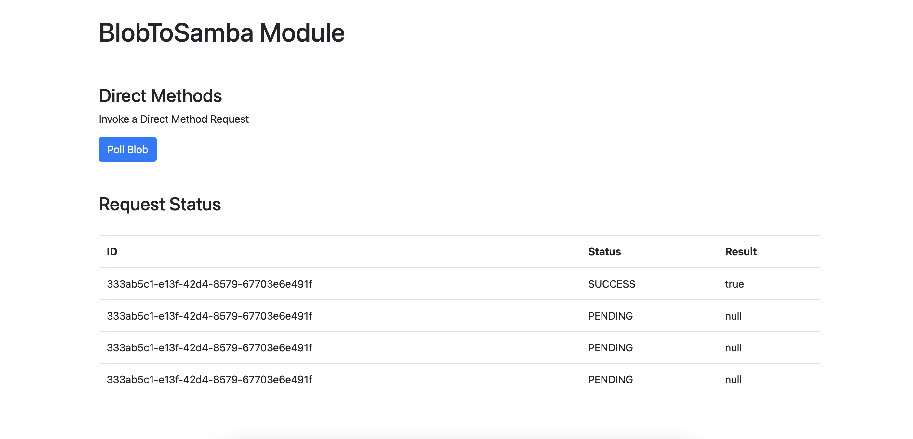
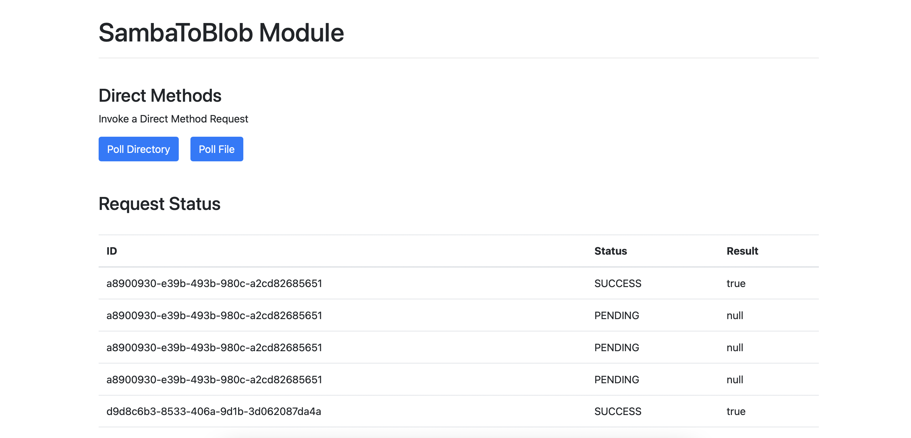

# iot-edge-cluster

This repository contains a kubernetes cluster made up of containerized IoT edge device modules.  You can run this cluster locally with `docker compose`, but should be deployed in Azure through AKS.

## table of contents
- [blobToSamba](#blobtosamba)
- [sambaToBlob](#sambatoblob)
- [getting started](#getting-started)
- [terraform](#terraform)

## blobToSamba



## sambaToBlob



## getting started

1. build the docker containers:

    ```sh
    docker compose build
    ```

2. run the docker containers:

    ```sh
    docker compose up -d
    ```

3. navigate to:

    - [http://localhost:8081](http://localhost:8081)
    
    - [http://localhost:8082](http://localhost:8082)

4. stop the docker containers:

    ```sh
    docker compose down
    ```

## terraform

1. update your azure credentials in the `terrform/variables.tf` file

2. navigate into the terraform directory, init, and validate:

    ```sh
    cd terraform

    terraform init

    terraform validate
    ```

3. plan the deployment:

    ```sh
    terraform plan
    ```

4. deploy:

    ```sh
    terraform deploy
    ```
